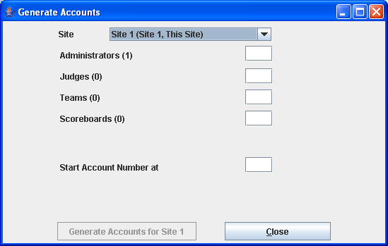
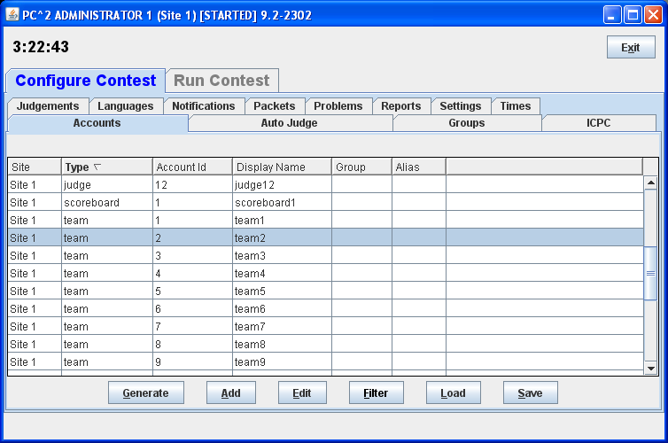
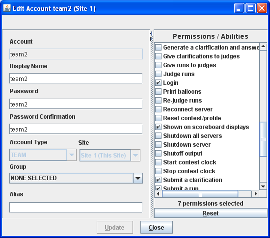
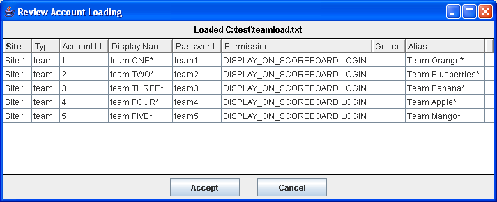

# Creando Cuentas para una Competencia

Existen tres formas para crear las cuentas de los participantes, jueces y tableros de una competencia:
 
1. Generar automáticamente un grupo de cuentas
1. Crear (o Editar) las cuentas individualmente
1. Cargar las cuentas a partir de un archivo
 
## Generando un grupo de cuentas

Para crear las cuentas, PC2 ofrece una utilidad que permite generar automáticamente un grupo de cuentas.
Para hacerlo, realice los siguientes pasos en la herramienta de administración ```pc2admin```:

- Seleccione la pestaña de **Configure Contest**
- Seleccione la pestaña de **Accounts**
- Haga clic en el botón de **Generate**

Al seguir estos pasos, aparece la siguiente ventana en donde se pueden crear los usuarios: 
 


En la ventana es posible ingresar la cantidad de nuevos usuarios que se quieren por cada tipo de usuario. 
Por ejemplo, allí aparece el texto **Administrators**. 
Al lado aparece el valor de **(1)** indicando que ya existe un usuario administrador.
Si se desea crear más administradores, es necesario indicar el número de nuevos administradores en la caja de texto.
Por ejemplo, si se escribe el valor de 1, se creará un nuevo administrador. 

Para crear los usuarios:

- Ingrese el número de usuarios de cada tipo que se desea crear
- Haga clic en el botón de **Generate**

Las cuentas de los usuarios son específicas a cada sitio.
Eso quiere decir que si se tienen varios sitios (o si se tienen varias competencias), es necesario crear los usuarios en cada uno de los sitios.


## Creando y Modificando cuentas invididuales

En PC2 es posible crear los usuarios individualmente.
Igualmente, se se crearon los usuarios como parte de un grupo, se pueden editar invidualmente.

Para crear o editar un usuario, es necesario ir hasta la pantalla que muestra el listado de usuarios en la herramienta de administración ```pc2admin```:

- Seleccione la pestaña de **Configure Contest**
- Seleccione la pestaña de **Accounts**

En pantalla debe aparecer un listado de cuentas como el que se muestra a continuación:



Allí es posible crear un nuevo usuario hacienco clic en **Create**.
Igualmnente es posible editar un usuario existente seleccionando el usuario en el listado y haciendo clic en **Edit**.

Al crear o editar un usuario, aparece la pantalla que se muestra a continuación:



En la pantalla aparecen varios campos a saber:

- **Display Name**, el nombre del usuario que saldrá en el tablero de resultados.
- **Password** y **Password Confirmation**, la contraseña que usa el usuario para ingresar al PC2
- **Permissions**, listado de permisos que tiene el usuario en el sistema


## Cargando las cuentas desde un archivo

En PC2 es posible crear los usuarios usando un archivo con datos. 
Esto es especialmente útil si se desean cargar los datos de un grupo de estudiantes o de personas. 
Puede ser mucho más sencillo cargar un archivo con datos que editar los usuarios uno por uno en la herramienta de administración.

Un archivo de datos de cuentas consiste de una serie de líneas de texto:

- la primera línea contiene los nombres de los campos que se deben cargar
- las siguientes líneas contienen los datos, donde cada valor está separado por un tabulador (un "tab", ASCII 8).
- las líneas que empiezan con **!** o **#** son comentarios

El archivo puede contener los siguientes campos:

- **site**, el identificador del sitio quie se desea actualizar (p.ej. 1 para "site1")
- **account**, el nombre de usuario usado para ingresar (p.ej. team1, judge4, scoreboard2)
- **password**, la contraseña
- **displayname**, el nombre a mostrar en los reportes y tableros de resultados
- **permdisplay**, *true* or *false* para indicar si se debe mostrar o no en el tablero de resultados.
- **permlogin**, *true* or *false* para indicar si el usuario tiene permitido ingresar al sistema

Por ejemplo, es posible crear el siguiente archivo con datos para crear un grupo de usuarios:

``site    acccount    password    displayname permdisplay``

``1   user1   user1   usuario 1   true`` 

``1   user2   user2   usuario 2   true``

``1   user3   user3   usuario 3   false``

Para cargar un archivo de usuarios, se deben realizar los siguientes pasos  en la herramienta de administración ```pc2admin```:
                                                                           
- Seleccione la pestaña de **Configure Contest**
- Seleccione la pestaña de **Accounts**
- Haga clic en el botón **Load**
- Seleccione el archivo con los datos y haga clic en **Ok**

Al terminar de cargar los datos, aparece en pantalla un listado de los usuarios cargados. 
El listado es similar al que se muestra a continuación:

